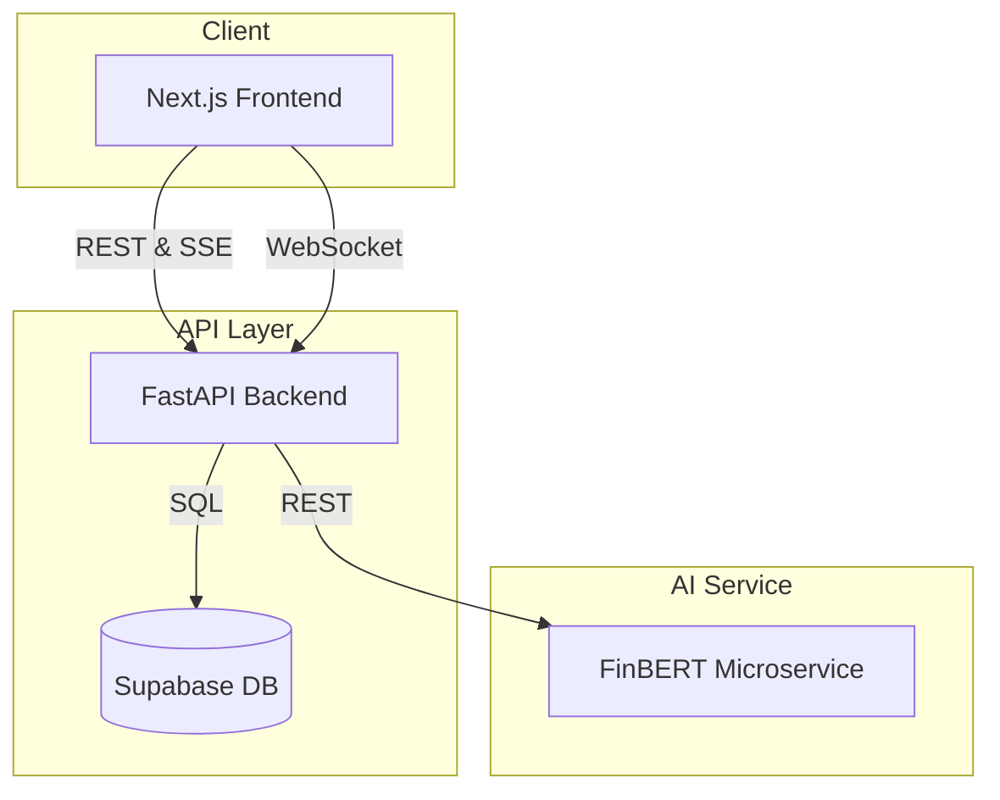

## Hypr App - Trade the Hype. Beat the Market.

Hypr is a full-stack application engineered to analyze financial market sentiment by aggregating data from news outlets and social media platforms. It uses a fine-tuned NLP model to generate a "Hype Index" and trading signals, demonstrating a modern, microservices-based approach to building data-intensive applications.

This project was built to explore the challenges of real-time data aggregation, asynchronous task processing, and the practical application of machine learning models in a decoupled system.

✨ [Live Preview](https://hypr-app.vercel.app/)


### Core Features

*   **Aggregates Market Data:** Pulls in financial news, company fundamentals, and social media posts from sources like Finnhub, Yahoo Finance, Reddit, and Bluesky.
*   **Analyzes Sentiment:** Uses a fine-tuned FinBERT model to understand the sentiment behind the text it finds.
*   **Streams Analysis Live:** Shows its work in real-time using Server-Sent Events (SSE), so you're not stuck looking at a loading spinner.
*   **Calculates a "Hype Index":** A custom score that combines news sentiment, social media buzz, and the model's confidence level into a single, understandable metric.
*   **Generates Trading Signals:** Offers a final **BUY**, **SELL**, or **HOLD** opinion based on its analysis.
*   **Seach and Discover:** You can search any for symbol and company or discover most popular and trending symbols.

### Tech Stack

  * **Backend:** Python, FastAPI
  * **Frontend:** Next.js, React, TypeScript
  * **ML:** Hugging Face Transformers, PyTorch, FinBERT
  * **Database:** Supabase (PostgreSQL)
  * **Communication:** WebSockets, Server-Sent Events (SSE), REST
  * **Deployment:** Docker, Railway, Hugging Face Spaces

### How It Works

The application is built on a decoupled, microservices architecture to ensure scalability and maintainability. The system is composed of three main services that communicate to deliver real-time analysis.



#### **1. Frontend (Next.js)**

This is the client-facing dashboard where users initiate a stock analysis. It uses **Server-Sent Events (SSE)** to display the analysis progress live to the requesting user and **WebSockets** to broadcast general market data to all connected clients.

#### **2. Backend (FastAPI)**

The backend is the central orchestrator. When a user requests an analysis, it executes the following pipeline:

1.  Fetches financial data from APIs like Finnhub and Yahoo Finance.
2.  Uses GPT-4 to generate creative, relevant search terms for the company.
3.  Scours social media platforms for posts using those terms.
4.  Sends each piece of text to the ML microservice for sentiment analysis.
5.  Crunches all the numbers to generate the final "Hype Index" and trading signal, then stores the result in a Supabase database.

#### **3. ML Microservice (FastAPI & Transformers)**

This is a dedicated, containerized service whose only job is to run the FinBERT model. The backend sends it text, and it returns a sentiment analysis score. Decoupling this computational task keeps the main application fast and responsive.


### Running Locally

1.  **Prerequisites:**

      * Python 3.9+, Node.js v18.0+, and Docker.
      * Create a `.env` file in the `backend` directory and add your API keys.

2.  **Start the Services:**

      * **Backend:**
        ```bash
        cd backend
        pip install -r requirements.txt
        python main.py
        ```
      * **ML Service:**
        ```bash
        cd service
        pip install -r requirements.txt
        python main.py
        ```

3.  **Start the Frontend:**

      * Navigate to the `frontend` directory:
        ```bash
        npm install && npm run dev
        ```
      * The application will be available at `http://localhost:3000`.
